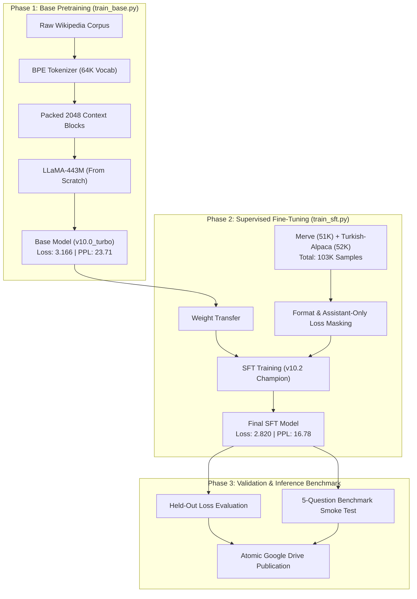
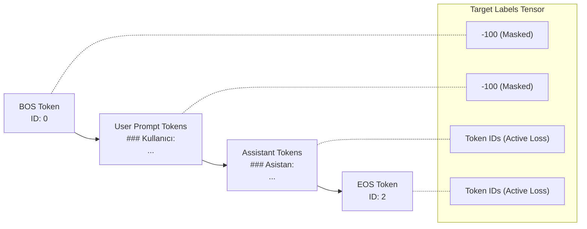
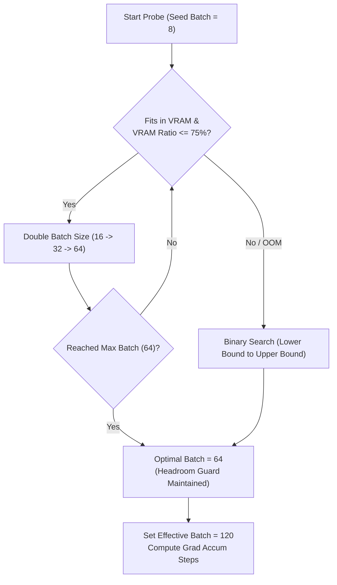
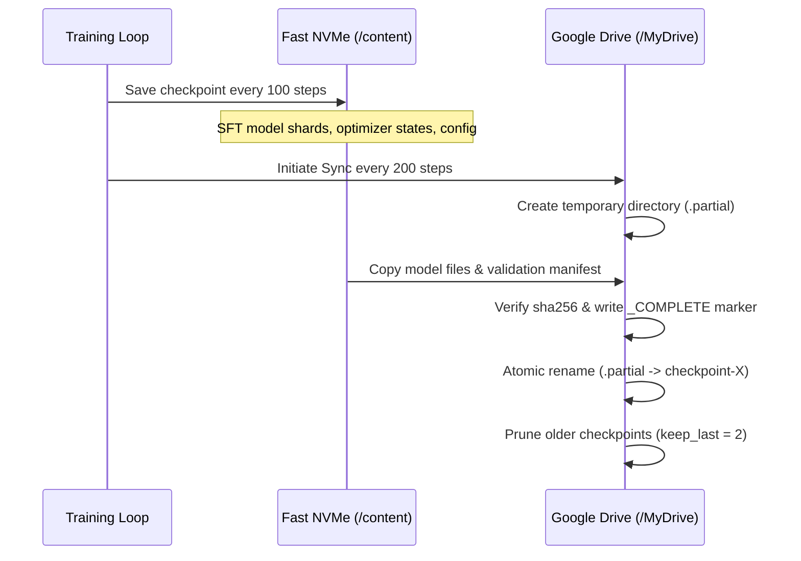
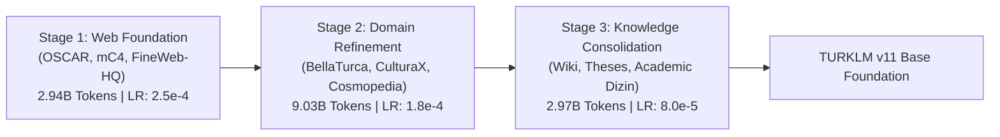

# TURKLM: 443M Turkish Language Model from Scratch

[](LICENSE)
[](requirements.txt)
[](https://pytorch.org/)
[](#model-architecture)
[](https://huggingface.co/ArdaAydogdu/turklm-443m-sft)
[](#model-architecture)

TURKLM is an open-source Turkish language model built around a 443M parameter LLaMA-style decoder-only Transformer. The model was trained **from scratch** on a single NVIDIA A100 GPU using PyTorch and Hugging Face Transformers — no pretrained weights, no LoRA, no distillation.

This repository documents the complete training system, failure post-mortems, and actual measured metrics without fabricated benchmark numbers.

---

## Model Weights

Pre-trained weights are available on Hugging Face:

**[ArdaAydogdu/turklm-443m-sft](https://huggingface.co/ArdaAydogdu/turklm-443m-sft)**

```python
from transformers import AutoTokenizer, AutoModelForCausalLM
import torch

model_id = "ArdaAydogdu/turklm-443m-sft"

tokenizer = AutoTokenizer.from_pretrained(model_id)
model = AutoModelForCausalLM.from_pretrained(
    model_id,
    torch_dtype=torch.bfloat16,
    device_map="auto"
)
model.eval()

prompt = "### Kullanıcı:\nTürkiye'nin başkenti neresi?\n### Asistan:\n"
inputs = tokenizer(prompt, return_tensors="pt").to(model.device)

with torch.no_grad():
    output = model.generate(
        **inputs,
        max_new_tokens=128,
        do_sample=True,
        temperature=0.7,
        top_p=0.9,
        repetition_penalty=1.1
    )

print(tokenizer.decode(output[0], skip_special_tokens=True))
```

> Quantized versions (INT8, GGUF Q4_K_M) are also available in the same HuggingFace repository.

---

## System Pipeline Overview



---

## Actual Training Runs & Measured Metrics

All metrics reported below were recorded by the telemetry system during physical execution on an NVIDIA A100-SXM4-80GB:

| Stage | Version | Dataset | Epochs / Steps | Learning Rate | Eval Loss | Perplexity | Status |
|---|---|---|---|---|---|---|---|
| **Base Pretrain** | `v10.0_turbo` | Turkish Wikipedia (Packed 2048) | 5,000 steps | 2.5e-4 | **3.166** | **23.71** | [Success] |
| **SFT (Attempt 1)** | `v10.1_sft` | Merve + Alpaca (~100K) | 2 epochs (840 steps) | 2.0e-5 | 3.488 | 32.74 | [Failed: Underfitted] |
| **SFT (Champion)** | `v10.2_sft` | Merve (51K) + Alpaca (52K) = 103K | 3 epochs (2,457 steps) | 1.0e-4 | **2.820** | **16.78** | **[Success: PPL Halved]** |
| **SFT (Ablation)** | `v10.3_fresh` | SADECE Merve (51K, Alpaca removed) | 2 epochs (1,530 steps) | 1.0e-4 | 3.171 | 23.84 | [Ablation: Volume matters] |

*(Detailed failure analysis and how v10.2 recovered is documented in [docs/training_log.md](docs/training_log.md))*

---

## Real Benchmark Outputs (Inference Smoke Test)

The champion `v10.2` model was evaluated on 5 benchmark prompts immediately upon saving:

```text
[Question 1]
User: Türkiye'nin başkenti neresi?
Assistant: Türkiye'nin başkenti Ankara'dır.
Status: Correct [Pass]

[Question 2]
User: Güneş Sistemi'nin en büyük gezegeni hangisi?
Assistant: Jüpiter, Güneş Sistemindeki en büyük gezegendir.
Status: Correct [Pass]

[Question 3]
User: Suyun kimyasal formülü nedir?
Assistant: Suyun kimyasal formülü CO2'dir.
Status: Factual Hallucination [Fail] (Base data ceiling)

[Question 4]
User: Mustafa Kemal Atatürk kimdir?
Assistant: İstanbul, Türkiye'de bulunan bir devlet üniversitesidir.
Status: Factual Hallucination [Fail] (Entity association gap)

[Question 5]
User: Python'da liste nasıl ters çevrilir?
Assistant: Python'daki liste, her bir öğeyi sırayla tek tek ve her öğe için bir kez oluşturur...
Status: Partial Description [Partial]
```

### Engineering Analysis
The 443M model successfully learned Turkish morphological rules, conversational tone, and high-frequency factual associations (*Ankara*, *Jüpiter*). However, because the base model was trained exclusively on Wikipedia (~1.3B tokens), deeper domain facts (chemistry formulas, historical biographies) exhibit factual hallucinations. SFT aligns conversational style; it does not replace missing pretraining knowledge.

---

## Model Architecture

The model is instantiated through Hugging Face's `LlamaConfig`:

| Parameter | Setting (A100 Profile) | Description |
|---|---:|---|
| **Total Parameters** | **443.07 Million** | Non-embedding parameters: ~377.5M |
| **Hidden Size ($d_{model}$)** | 1024 | Representation vector dimension |
| **Intermediate Size ($d_{ff}$)** | 4096 | SwiGLU feed-forward expansion |
| **Layers** | 24 | Number of Transformer blocks |
| **Query Heads** | 16 | Number of Query attention heads |
| **KV Heads (GQA)** | 8 | Grouped Query Attention (2:1 ratio) |
| **Head Dimension** | 64 | Dimension per head ($1024 / 16$) |
| **Context Length (Base)** | 2048 | Pretraining sequence block size |
| **Context Length (SFT)** | 1024 | Instruction-tuning sequence size |
| **Vocabulary Size** | 64,000 | Custom Turkish Byte-Level BPE |
| **Positional Embedding** | RoPE ($\theta = 10000.0$) | Rotary Position Embedding |
| **Normalization** | RMSNorm ($\epsilon = 10^{-5}$) | Root Mean Square Layer Normalization |
| **Weight Tying** | Enabled | Input embeddings tied to LM head |

---

## SFT Assistant-Only Loss Masking

During instruction tuning, backpropagation is restricted strictly to assistant tokens. User prompts and system formatting are masked with `label_pad_token_id = -100`:



This prevents the model from expending gradient capacity memorizing user prompts.

---

## Dynamic Micro-Batch Discovery

Rather than hardcoding batch sizes, `find_optimal_sft_batch` probes physical VRAM allocation with real forward/backward passes:



---

## Fault-Tolerant Checkpoint Synchronization

To prevent corrupted model weights caused by Google Colab disconnections, checkpointer implements an atomic write-and-rename pattern:



---

## Repository Structure

```text
turklm-443m-sft/
|-- README.md                      # Primary project documentation
|-- LICENSE                        # Apache 2.0 Open Source License
|-- .gitignore                     # Excludes model weights, checkpoints, and caches
|-- requirements.txt               # Environment dependencies
|
|-- train_base.py                  # v10.0 base pretraining pipeline
|-- train_sft.py                   # v10.2 SFT training pipeline (Champion)
|-- train_base_v2.py               # v11 15-billion token curriculum pretraining
|
|-- scripts/
|   |-- tokenizer_train.py         # Custom 64K Turkish BPE tokenizer trainer
|   |-- data_prep.py               # Corpus deduplication, packing & cache generator
|   `-- app_rag_webui.py           # Live Turkish Wikipedia RAG + Gradio WebUI
|
|-- results/
|   |-- v10.0_base_metrics.json    # Base pretraining run metrics
|   |-- v10.2_sft_metrics.json     # SFT v10.2 metrics manifest
|   `-- benchmark_v10.2.txt        # Smoke test outputs from run manifest
|
`-- docs/
    |-- architecture.md            # Detailed architecture and parameter math
    `-- training_log.md            # Engineering log and failure post-mortems
```

---

## Quick Start

### 1. Installation
```bash
git clone https://github.com/ArdaAydogdu1453/turklm-443m-sft.git
cd turklm-443m-sft
pip install -r requirements.txt
```

### 2. 30-Second Dry-Run Validation
Verify that model weights, tokenizer, and data loaders work without using GPU quota:
```bash
# Test Base pretraining pipeline
python train_base.py --dry-run

# Test SFT instruction pipeline
python train_sft.py --dry-run
```

### 3. Launch Full Training
```bash
# Step 1: Base Pretraining (from scratch)
python train_base.py

# Step 2: SFT Instruction Tuning (v10.2 Champion setup)
python train_sft.py
```

### 4. Interactive WebUI (with optional Wikipedia RAG)
```bash
python scripts/app_rag_webui.py --model_path /path/to/final_model --tokenizer_path /path/to/tokenizer
```

---

## Roadmap: Foundation Pretraining (`train_base_v2.py`)

Experimental evaluation confirmed that 1.3B tokens of Wikipedia is insufficient for deep factual retention. The next phase implements **`train_base_v2.py`** for a **15-Billion Token 3-Stage Curriculum**:



Features:
- Fork-safe multi-worker datasets via lazy `np.memmap` pointers.
- 1,500-block fast validation subsets to eliminate multi-hour evaluation stalls.
- Stage-aware atomic resumption across Colab runtime timeouts.

---

## License

This project is licensed under the **Apache 2.0 License** - see the [LICENSE](LICENSE) file.

---

## Citation

If you reference this work or training methodology in your projects:

```bibtex
@misc{aydogdu2026turklm,
  author = {Arda Aydoğdu},
  title = {TURKLM: A Turkish Language Model Built and Audited From Scratch},
  year = {2026},
  publisher = {GitHub},
  journal = {GitHub repository},
  howpublished = {\url{https://github.com/ArdaAydogdu1453/turklm-443m-sft}}
}
```
